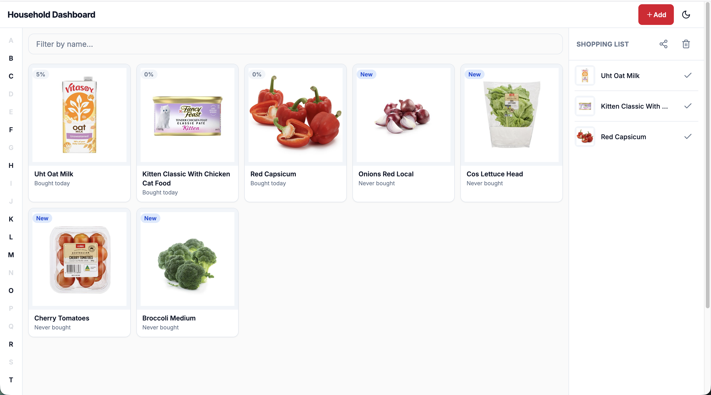

# Household Dashboard



A wall-mounted iPad grocery dashboard. Shows your household grocery items sorted by how overdue they are for restocking. Tap a product to mark it as bought and add it to a shared shopping list.

Runs in Docker on a home server. No login required (LAN-only). Light and dark mode. Optimised for iPad mini 3 (iOS 12 Safari).

---

## How it works

**Product grid (70%)** — Products are sorted by a priority score (`days since last purchase ÷ repurchase interval`). Overdue items bubble to the top with a red "Overdue" badge. Items never bought sit at the bottom with a blue "New" badge. Tap any tile to record a purchase and add it to the shopping list.

**Shopping list sidebar (30%)** — Always visible on the right. Shows everything currently in your Google Tasks list. Remove individual items or clear all at once. Polls Google Tasks every 30 seconds — items checked off on your phone disappear automatically.

**Add products** — Tap "Add" in the header to search Coles, Woolworths, and IGA simultaneously. Results include store badge, price, and product image. Set a repurchase interval and the priority score handles the rest.

**Share list** — Tap the share icon in the sidebar to generate a QR code. Scanning it opens a mobile-optimised page with options to save the list via the Web Share API (Reminders, Notes, Messages), SMS, or email.

**Idle dim** — After 5 minutes without interaction the screen dims to protect the display. Tap anywhere to wake.

---

## Setup

### Prerequisites

- Docker (for production) or Node 20+ (for local dev)
- A RapidAPI key (free tier, 1,000 req/month) for Coles + Woolworths search
- Google OAuth credentials for shopping list sync (see [docs/GOOGLE_TASKS_SETUP.md](docs/GOOGLE_TASKS_SETUP.md))

### Running locally

```bash
git clone <repo> && cd coles-personal-dashboard-picker
npm install

cp .env.example .env
# Edit .env — see Environment variables below

npx prisma migrate dev
npm run dev
```

Open [http://localhost:3000/dashboard](http://localhost:3000/dashboard).

### Running in Docker (Unraid / home server)

The image is published to `ghcr.io/finnmo/coles-personal-dashboard-picker:latest` via GitHub Actions on every push to `main`.

**Volumes**

| Container path | Purpose                                             |
| -------------- | --------------------------------------------------- |
| `/app/data`    | SQLite database — mount a persistent host path here |

**Ports**: `3000`

**Environment variables**: see table below. The only one that's mandatory without a sensible default is `DATABASE_URL` (already set to `file:/app/data/dashboard.db` by default if omitted).

Migrations run automatically on container start.

#### Unraid template (manual setup)

1. Add a new Docker container in the Unraid UI
2. Set **Repository** to `ghcr.io/finnmo/coles-personal-dashboard-picker:latest`
3. Set **Network Type** to **Bridge**
4. Add a **Path**: Container path `/app/data` → Host path `/mnt/user/appdata/household-dashboard`
5. Add a **Port**: Container `3000` → Host `3000`
6. Add each environment variable from the table below

---

## Environment variables

| Variable               | Required           | Description                                                            |
| ---------------------- | ------------------ | ---------------------------------------------------------------------- |
| `DATABASE_URL`         | No                 | SQLite path — defaults to `file:/app/data/dashboard.db`                |
| `LIST_PROVIDER`        | No                 | `google_tasks` · `apple_reminders` · leave blank for local-only        |
| `GOOGLE_CLIENT_ID`     | If Google Tasks    | OAuth client ID                                                        |
| `GOOGLE_CLIENT_SECRET` | If Google Tasks    | OAuth client secret                                                    |
| `GOOGLE_REFRESH_TOKEN` | If Google Tasks    | Run `npx tsx scripts/google-oauth-setup.ts` to generate                |
| `GOOGLE_TASK_LIST_ID`  | If Google Tasks    | Task list ID — script prints available lists                           |
| `APPLE_SHORTCUTS_NAME` | If Apple Reminders | Name of your iOS Shortcut                                              |
| `RAPIDAPI_KEY`         | No                 | Free-tier key for Coles + Woolworths search (IGA works without it)     |
| `SHARE_HOST`           | No                 | LAN IP or hostname for QR share URLs — required when running in Docker |
| `SHARE_SECRET`         | No                 | Secret for signing share tokens — random fallback used if unset        |

See `.env.example` for full descriptions and setup instructions.

---

## Google Tasks setup

Run the helper script once to get your OAuth refresh token and task list ID:

```bash
GOOGLE_CLIENT_ID="..." GOOGLE_CLIENT_SECRET="..." \
npx tsx scripts/google-oauth-setup.ts
```

Full step-by-step: [docs/GOOGLE_TASKS_SETUP.md](docs/GOOGLE_TASKS_SETUP.md)

---

## Tech stack

|                |                                                                   |
| -------------- | ----------------------------------------------------------------- |
| Framework      | Next.js 14 (App Router), React 18, TypeScript                     |
| Database       | SQLite via Prisma 5                                               |
| Styling        | Tailwind CSS, next-themes                                         |
| Data fetching  | SWR (30s polling for shopping list sync)                          |
| Product search | Coles + Woolworths (RapidAPI) · IGA (scrape) with circuit breaker |
| List sync      | Google Tasks API (OAuth2 refresh token)                           |
| Deploy         | Docker — image published to ghcr.io via GitHub Actions            |

---

## Scripts

```bash
npm run dev          # development server
npm run build        # production build
npm run lint         # ESLint
npm run type-check   # TypeScript
npm test             # unit + integration tests (Vitest)
npm run db:studio    # Prisma Studio
```
